# Database ERD — Enterprise E-Commerce Platform

> Diagrams use [Mermaid](https://mermaid.js.org/) syntax. Render in GitHub, GitLab, or any Mermaid-compatible viewer.

---

## ERD 1: Identity & Access Management

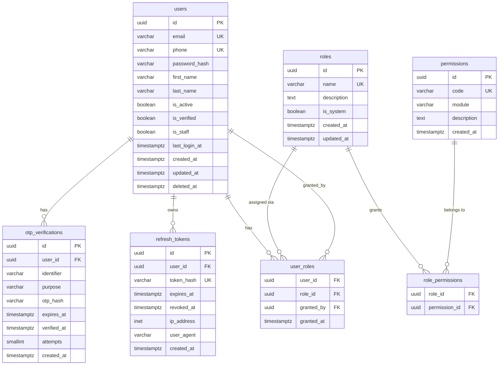

---

## ERD 2: Customer & Vendor

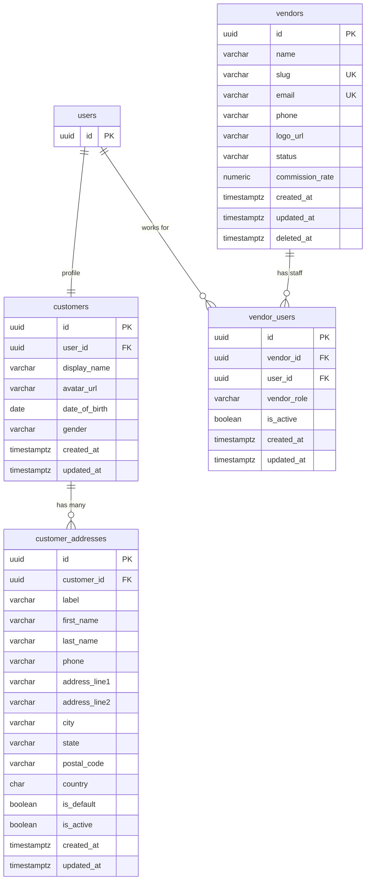

---

## ERD 3: Product Catalog

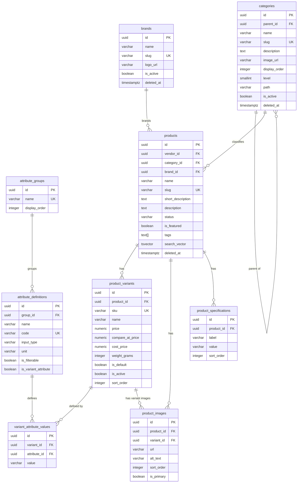

---

## ERD 4: Inventory

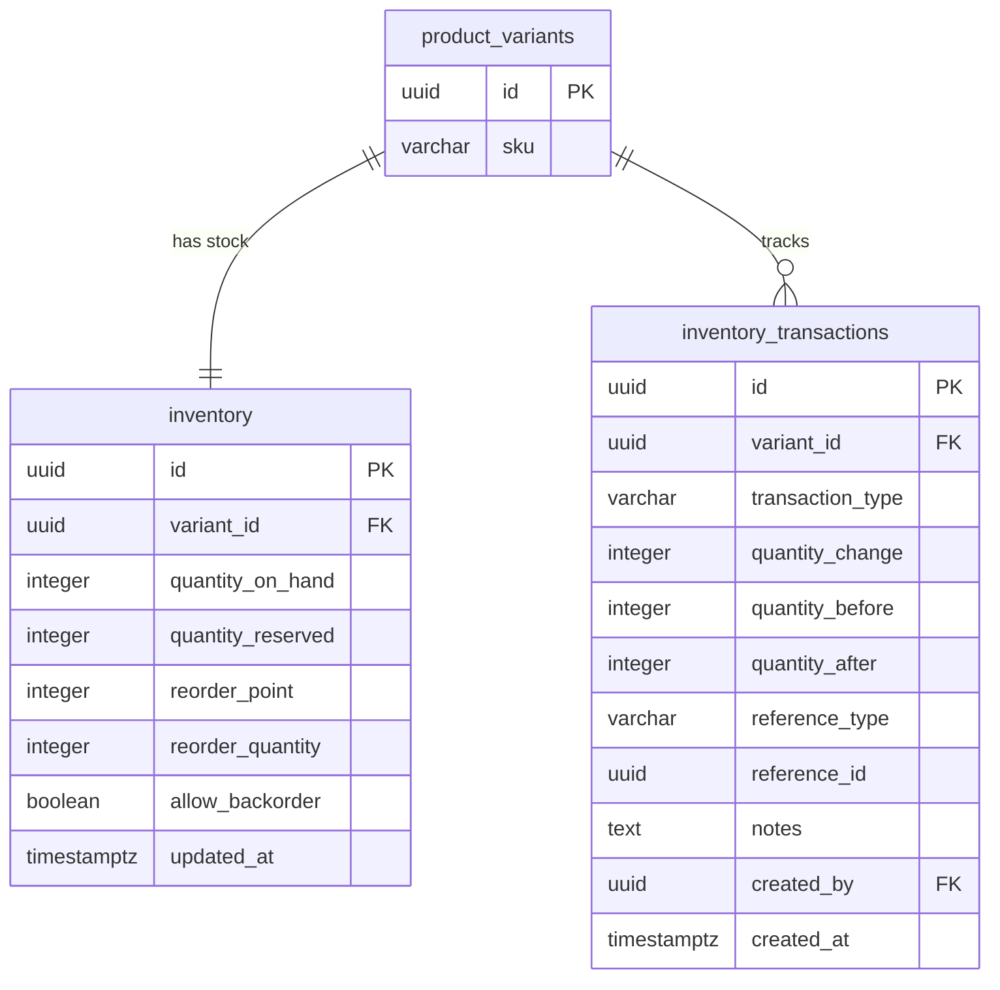

---

## ERD 5: Cart & Engagement

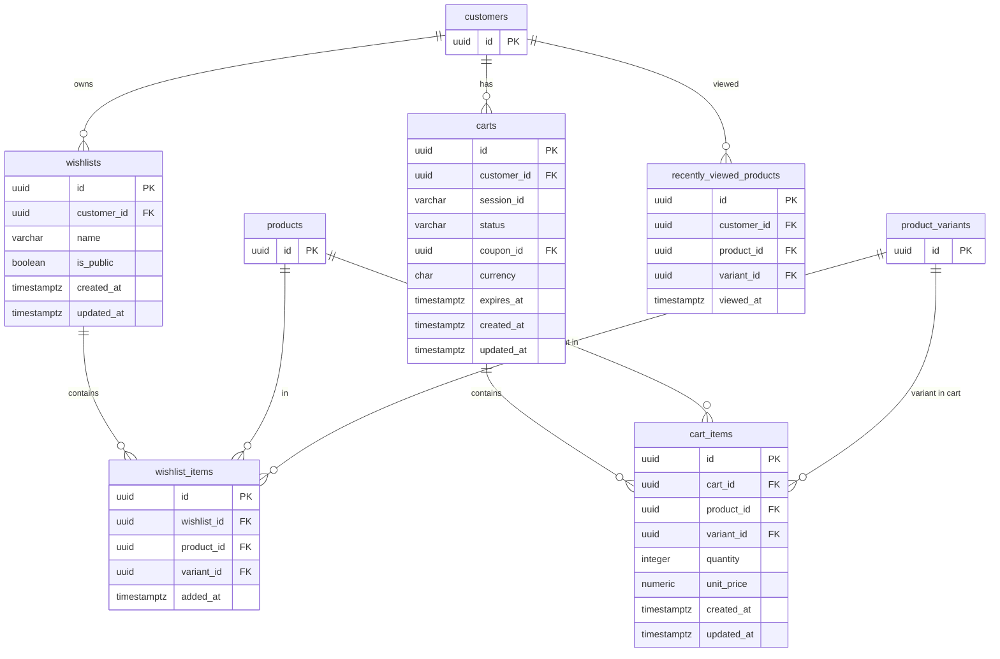

---

## ERD 6: Orders

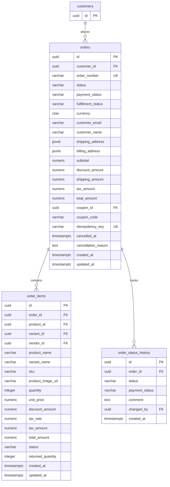

---

## ERD 7: Payments

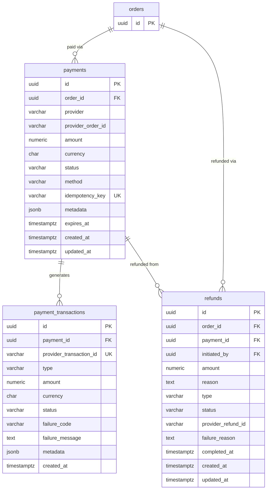

---

## ERD 8: Shipping

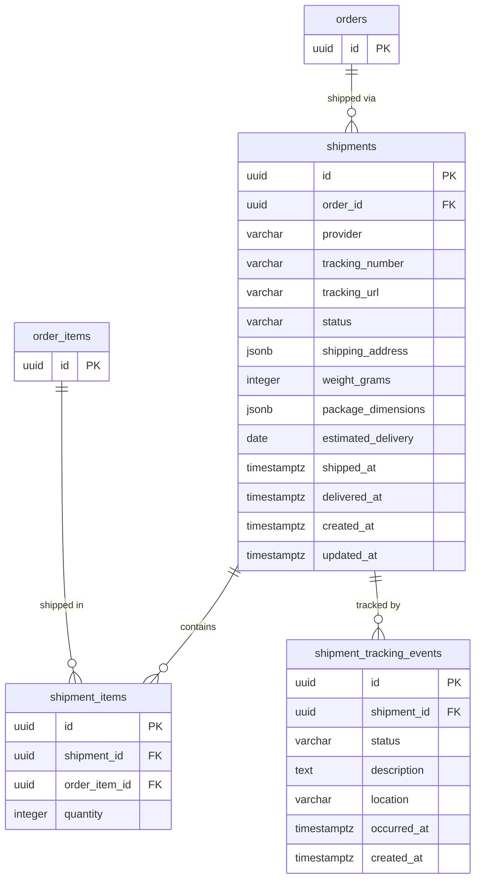

---

## ERD 9: Promotions

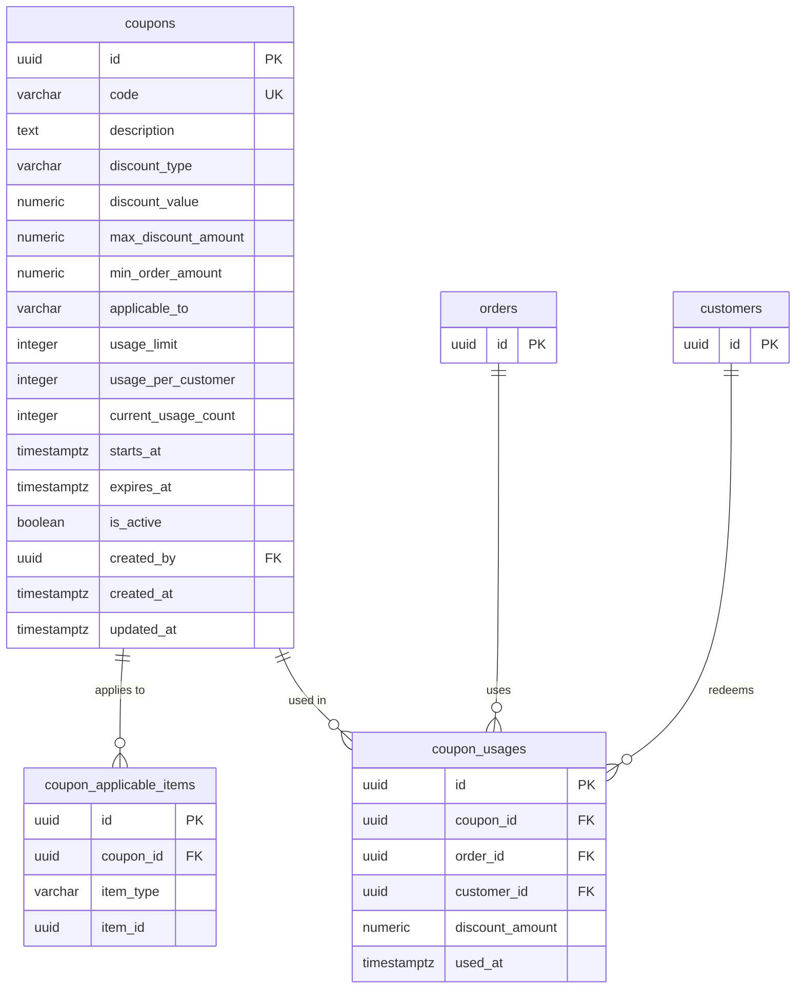

---

## ERD 10: Reviews & Notifications

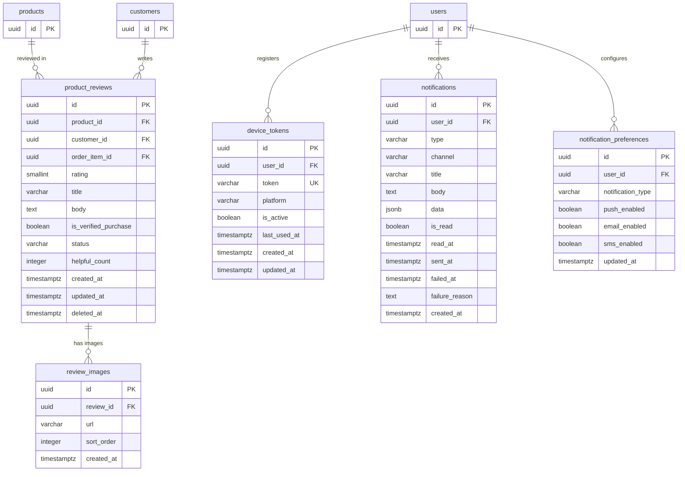

---

## High-Level Domain Relationship Map

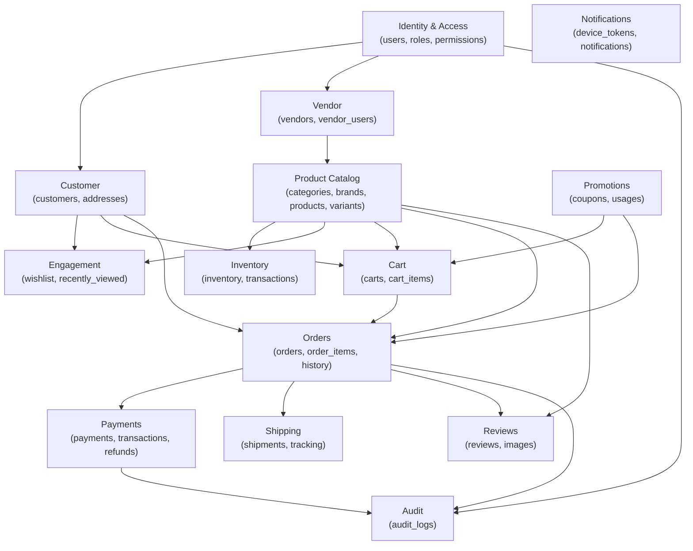
